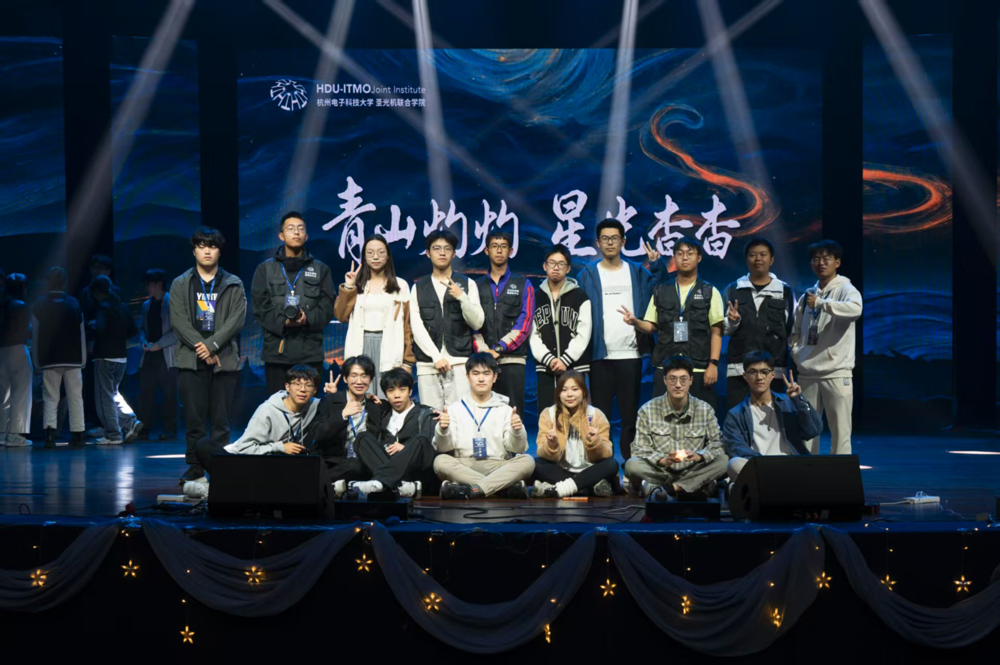
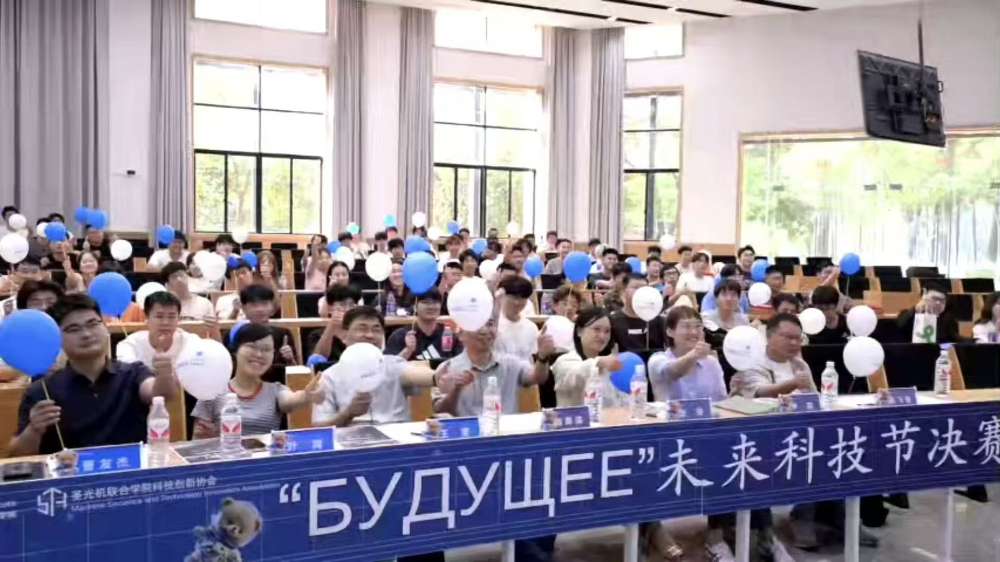
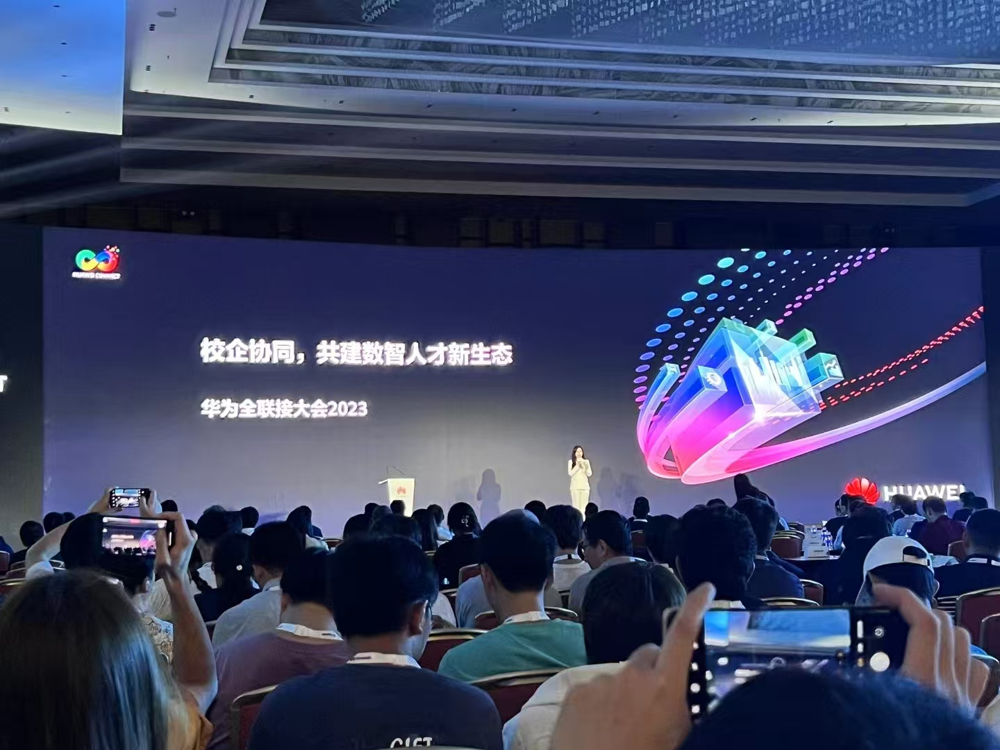
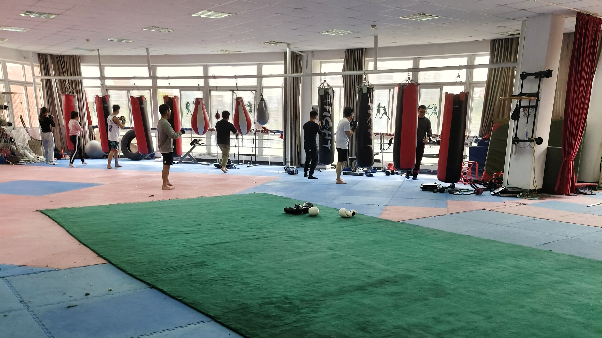

# 🐎 Competitions

## International & National Prizes

	<ul>
		<li><i>2025</i>: <a href="http://www.fwwb.org.cn/">China College Students' Service Outsourcing Innovation and Entrepreneurship Competition</a> (<b>National Third Prize</b>, <b>Key Member</b>)</li>
		<li><i>2025</i>: <a href="https://culsc.cn/#/Home">China Undergraduate Life Sciences Contest (Innovation and Entrepreneurship Category)</a> (<b>National Third Prize</b>, <b>Key Member</b>)</li>
		<li><i>2024</i>: <a href="https://pilcchina.org/home">China International College Students' Innovation Competition</a> (<b>International Bronze Medal</b>, <b>Project Leader</b>)</li>
		<li><i>2024</i>: <a href="https://gxict.bupt.edu.cn">ICT Industry-Teaching Integration Innovation Competition</a> (<b>National Second Prize</b>, <b>Key Member</b>)</li>
		<li><i>2023</i>: <a href="https://cy.ncss.cn/">China International College Students' Innovation Competition</a> (<b>National Gold Medal</b>, <b>Key Member</b>)</li>
		<li><i>2023</i>: <a href="https://pilcchina.org/home">China International College Students' Innovation Competition</a> (<b>International Bronze Medal</b>, <b>Key Member</b>)</li>
		<li><i>2023</i>: <a href="https://www.smartcar.zone/index.html">National Smart Car Competition for College Students</a> (<b>National First Prize</b>, <b>Key Member</b>)</li>
	</ul>

⬆ Scrollable

## Regional & Provincial Prizes

	<ul>
		<li><i>2025</i>: <a href="http://www.3chuang.net/">National College Student E-Commerce “Innovation, Creativity and Entrepreneurship” Competition</a> (<b>Provincial Second Prize</b>, <b>Key Member</b>)</li>
		<li><i>2025</i>: <a href="https://tiaozhanbei.net/">"Challenge Cup" National College Student Curricular Academic Science and Technology Works Competition</a> (<b>Provincial Bronze Medal</b>, <b>Project Leader</b>)</li>
		<li><i>2024</i>: <a href="https://cy.ncss.cn/">China International College Students' Innovation Competition</a> (<b>Provincial Silver Medal</b>, <b>Project Leader</b>)</li>
		<li><i>2024</i>: <a href="https://tiaozhanbei.net/">"Challenge Cup" China College Student Business Plan Competition</a> (<b>Provincial Bronze Medal</b>, <b>Key Member</b>)</li>
		<li><i>2024</i>: <a href="http://www.fwwb.org.cn/">China College Students' Service Outsourcing Innovation and Entrepreneurship Competition</a> (<b>Regional Third Prize</b>, <b>Project Leader</b>)</li>
		<li><i>2023</i>: <a href="https://cy.ncss.cn/">China International College Students' Innovation Competition</a> (<b>Provincial Bronze Medal</b>, <b>Key Member</b>)</li>
	</ul>

⬆ Scrollable

# 🪙 Intellectual Properties

## National Invention Patents (国家发明专利)

	<ul>
		<li><i>2025</i>: 一种不完整多模态分层特征融合网络的MCI转换分类方法 (<b>受理</b>, <b>第四发明人</b>)</li>
		<li><i>2025</i>: 一种基于选择性状态空间融合的眼科影像分类方法 (<b>公开</b>, <b>第二发明人</b>)</li>
		<li><i>2025</i>: 一种基于NRGMFF和fMRI的脑疾病分类方法 (<b>受理</b>, <b>第二发明人</b>)</li>
		<li><i>2025</i>: 一种基于GL-LCM模型的高分辨率胸部X光图像骨抑制方法 (<b>初审合格</b>, <b>第一发明人</b>)</li>
		<li><i>2024</i>: 基于不完整三模态共注意融合的轻度认知障碍转换预测方法 (<b>公开</b>, <b>第四发明人</b>)</li>
		<li><i>2024</i>: 一种基于多模态注意力融合网络的ADHD分类诊断方法 (<b>公开</b>, <b>第六发明人</b>)</li>
		<li><i>2024</i>: 一种基于BS-LDM模型的高分辨率胸部X光图像骨抑制方法 (<b>公开</b>, <b>第一发明人</b>)</li>
		<li><i>2023</i>: 一种基于TC-DiffRecon模型的纹理协调的MRI图像重建方法 (<b>公开</b>, <b>第四发明人</b>)</li>
		<li><i>2023</i>: 一种基于条件扩散模型的胸部X光图像骨抑制方法 (<b>公开</b>, <b>第一发明人</b>)</li>
	</ul>

⬆ Scrollable

## Computer Software Copyrights (计算机软件著作权)

	<ul>
		<li><i>2025</i>: 基于双目眼底医学影像的眼科疾病智能诊断系统 (<b>授权</b>, <b>第三著作权人</b>)</li>
		<li><i>2024</i>: 医用智能辅助肺癌CT影像分类软件 (<b>授权</b>, <b>第三著作权人</b>)</li>
		<li><i>2024</i>: 医用智能MRI-PET跨模态转换系统 (<b>授权</b>, <b>第一著作权人</b>)</li>
		<li><i>2024</i>: 基于扩散模型的胸部X射线骨抑制系统 (<b>授权</b>, <b>第一著作权人</b>)</li>
		<li><i>2024</i>: 数字安全大会通用门户网站平台 (<b>授权</b>, <b>第一著作权人</b>)</li>
		<li><i>2024</i>: 数字安全大会通用门户小程序软件 (<b>授权</b>, <b>第一著作权人</b>)</li>
	</ul>

⬆ Scrollable

# 🏫 Clubs

Chairman

  
[HDU-ITMO Student Union](https://joint.hdu.edu.cn/main.htm)

*2024.9 - Present*: Chairman

*2023.9 - 2024.9*: Minister

*2022.9 - 2023.9*: Member
  

Vice Chairman

  
[HDU-ITMO Technology and Innovation Association](https://joint.hdu.edu.cn/main.htm)

*2024.9 - Present*: Vice Chairman

*2023.9 - 2024.9*: Minister

*2022.9 - 2023.9*: Member
  

Member

  
[HDU Huawei Smart Base Association](https://edu.hicomputing.huawei.com/AIeducationbase)

*2023.3 - Present*: Member
  

Member

  
[HDU Fight Club](https://www.thepaper.cn/newsDetail_forward_11946303)

*2022.9 - Present*: Member
  

⬆ Scrollable

